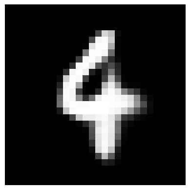

# Introduction

Um autoencoder variacional (VAE) é um tipo de rede neural que combina elementos de autoencoders e modelos generativos probabilísticos. Ao contrário de autoencoders tradicionais, um VAE mapeia os exemplos de entrada para uma distribuição de probabilidade no espaço latente em vez de mapeá-los para pontos específicos nesse espaço. Isso significa que, em vez de apenas aprender uma representação comprimida dos dados de entrada, o VAE aprende a distribuição das representações latentes.

O VAE consiste em duas partes principais: um codificador, que mapeia as entradas para distribuições no espaço latente, e um decodificador, que reconstrói as entradas a partir das amostras aleatórias tiradas dessa distribuição. Durante o treinamento, o VAE tenta minimizar a diferença entre a distribuição das representações latentes dos exemplos de treinamento e uma distribuição de referência, geralmente uma distribuição normal multivariada.

Uma vez treinado, o VAE pode ser usado para gerar novas amostras, amostrando aleatoriamente do espaço latente e passando essas amostras pelo decodificador. Isso permite que o VAE aprenda uma distribuição rica e contínua dos dados de entrada, possibilitando a geração de novas amostras que se assemelham aos dados de treinamento.

# Setup

Importar bibliotecas para carregar dados é essencial para preparar conjuntos de treinamento e teste.

```python
import torch
import torch.nn as nn
import torch.nn.functional as F
import torch.optim as optim
from torch.utils.data import DataLoader
from torchvision import datasets, transforms
import matplotlib.pyplot as plt
```

# Model Implementation

```python
class VAE(nn.Module):
    def __init__(self):
        super(VAE, self).__init__()

        self.fc1 = nn.Linear(784, 400)
        self.fc_mu = nn.Linear(400, 20)  # Camada de média do espaço latente
        self.fc_logvar = nn.Linear(400, 20)  # Camada de log-variância do espaço latente
        self.fc2 = nn.Linear(20, 400)
        self.fc3 = nn.Linear(400, 784)

    def encode(self, x):
        h1 = F.relu(self.fc1(x))
        mu = self.fc_mu(h1)
        logvar = self.fc_logvar(h1)

        return mu, logvar

    def reparameterize(self, mu, logvar):
        std = torch.exp(0.5 * logvar)
        eps = torch.randn_like(std)
        z = mu + eps * std
        return z

    def decode(self, z):
        h2 = F.relu(self.fc2(z))
        h3 = torch.sigmoid(self.fc3(h2))
        return h3

    def forward(self, x):
        mu, logvar = self.encode(x.view(-1, 784))
        z = self.reparameterize(mu, logvar)
        decode = self.decode(z)
        return decode, mu, logvar
```

# Kullback-Leibler Divergence

```python
def loss_function(recon_x, x, mu, logvar):
    BCE = F.binary_cross_entropy(recon_x,
                                 x.view(-1, 784),
                                 reduction='sum')
    KLD = -0.5 * torch.sum(1 + logvar - mu.pow(2) - logvar.exp())
    return BCE + KLD # escalarização das funções do modelo
```

# Load Data

```python
%%capture
transform = transforms.ToTensor()
train_data = datasets.MNIST(root='./data',
                            train=True,
                            download=True,
                            transform=transform)
train_loader = DataLoader(train_data,
                          batch_size=128,
                          shuffle=True)
```

# Hyperparameters & Model Create

```python
device = torch.device('cuda' if torch.cuda.is_available() else 'cpu')

batch_size = 128
learning_rate = 1e-3
epochs = 60

model = VAE().to(device)
optimizer = optim.Adam(params=model.parameters(), lr=learning_rate)
```

# Model Train

```python
%%time
model.train()
loss_history = []

for epoch in tqdm(range(epochs)):
    total_loss = 0
    for batch_idx, (data, _) in enumerate(train_loader):
        x = data.to(device)
        optimizer.zero_grad()

        recon_batch, mu, logvar = model(x)
        loss = loss_function(recon_batch, x, mu, logvar)
        loss.backward()
        optimizer.step()

        total_loss += loss.item()

        if batch_idx % 100 == 0:
            print('Epoch [{}/{}], Step [{}/{}], Loss: {:.4f}'
                  .format(epoch+1, epochs, batch_idx+1, len(train_loader), loss.item() / len(data)))
    loss_history.append(total_loss / len(train_data))
    print('Epoch [{}/{}], Average Loss: {:.4f}'.format(epoch+1, epochs, total_loss / len(train_data)))
```

# Generate

```python
def generate_digit():
  with torch.no_grad():
      z = torch.randn(1, 20).to(device)
      reconstructed_img = model.decode(z).to('cpu')
      plt.imshow(reconstructed_img.view(28, 28).numpy(),
                 cmap='gray')
      plt.axis('off')
      plt.show()


for i in range(5):
  generate_digit()
```

# Results

<figure>
	
	<figcaption>Figure 1: Imagem Gerada pelo Modelo</figcaption>
</figure>
